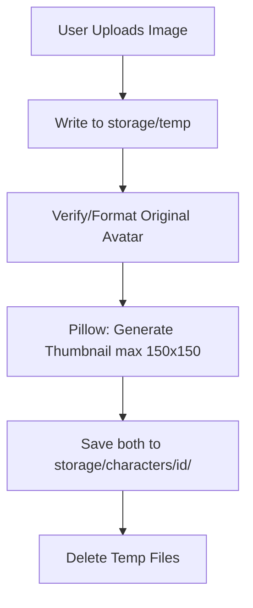

# Candlekeep Core: Characters, Personas, and Asset Storage

Candlekeep Core supports complex roleplay settings by managing Character cards (non-player characters that the LLM roleplays as), User Personas (profiles representing the user within the chat context), and local media assets (avatars and thumbnails).

---

## 1. Character Cards (V2 Spec Compatible)

The `Character` entity represents a fully loaded character profile. It is compatible with the SillyTavern V2 character card specifications.

### Core Data Structure
*   **System Prompt Override (`system_prompt`)**: A per-character instruction block that replaces the global template system prompt when active.
*   **Alternate Greetings (`alternate_greetings`)**: A list of alternative introductory messages. The system can randomly select or allow the user to pick one when launching a chat.
*   **Example Dialogues (`example_dialogues`)**: Structured exchanges illustrating the character's speaking patterns, phrasing, and behavior. These are injected into the prompt context dynamically.
*   **Tags & Classification**: String arrays supporting tags, species, age, gender (with customized text mappings for non-binary classifications), and creator attribution metadata.

---

## 2. User Personas

The `Persona` model defines the profile of the user participating in the chat session.
*   **Name & Description**: Contains the name and detail description of the user's roleplay alias.
*   **Prompt Integration**: If a persona is active in a chat, its details are injected into the compiled prompt under the `persona` component, informing the LLM of who it is interacting with.

---

## 3. Storage and Asset Directory Layout

Media assets like custom avatars and profile images are saved locally to a disk path specified by the `STORAGE_PATH` configuration value.

The directory layout is structured as:
```text
storage/
├── characters/
│   └── {character_id}/
│       ├── avatar.png
│       └── avatar_thumbnail.png
├── personas/
│   └── {persona_id}/
│       ├── avatar.png
│       └── avatar_thumbnail.png
└── temp/                      # Temp folder for file processing and uploads
```

Startup directories are verified and initialized by `ensure_storage_directories` in [storage.py](file:///srv/project/personal/candlekeep-core/src/core/utils/storage.py).

---

## 4. Image Processing & Thumbnail Generation

When a user uploads an avatar for a Character or Persona, the asset pipeline processes the file before saving:



### Pillow Image Transformation
The system uses the **Pillow** library to handle image formatting and resize operations:
1. **Format Validation**: Converts images to compatible PNG/JPEG formats.
2. **Thumbnail Scaling**: Scales the image to a standardized thumbnail dimension (e.g., maximum width/height of 150 pixels) while maintaining aspect ratios.
3. **Storage Paths**: Returns the relative paths (e.g., `characters/ch_1234567890/avatar_thumbnail.png`) to be saved in the database columns `avatar` and `avatar_thumbnail`.

### Asset Deletion and Cleanup
To prevent disk space leakage:
*   When a character or persona is updated with a new avatar, the system deletes the old avatar and thumbnail files.
*   When a character or persona is deleted, the repository service calls `delete_character_files()` or `delete_persona_files()`, which recursively removes the entity's storage folder (`storage/characters/{id}/`).
