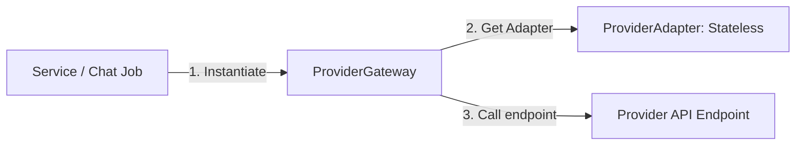

# The Bannered Mare: LLM Integration and Connection Architecture

The Bannered Mare supports multi-provider LLM integrations (both cloud APIs like OpenAI and Anthropic, and local APIs like Ollama and LM Studio). This architecture uses a stateless adapters pattern coordinated by a centralized gateway, separating connection configurations from API transport mechanics.

---

## 1. Provider, Model, and ModelFamily

Three core database models define LLM connectivity:

1. **Provider**: Represents an API service instance (e.g., "Ollama Local" or "OpenAI Production"). It contains the base URL, active toggle, last synced timestamp, and the key name of the environment variable containing the credentials.
2. **ModelFamily**: Grouping of similar models defining default parameters (temperature, frequency penalty, etc.) and configuration parameters like prompt structure templates.
3. **Model**: A concrete, selectable LLM model (e.g., `gpt-4o` or `llama3`) linked to a specific Provider and ModelFamily. It inherits parameters from its family and supports individual overrides.

---

## 2. Stateless Adapter Pattern

To prevent duplicate API transportation logic, The Bannered Mare employs a stateless adapter pattern. The abstract class `ProviderAdapter` (defined in [base.py](../../src/provider/adapters/base.py)) exposes five core hooks:

*   `build_url`: Assembles the full API endpoint URL.
*   `build_headers`: Assembles authentication headers (API keys, custom agents, org headers).
*   `build_payload`: Converts OpenAI-formatted system/user messages and merged generation parameters into the provider's native JSON request body.
*   `parse_response`: Transforms the native JSON response into a normalized `CompletionResponse`.
*   `parse_stream_line`: Parses a single Server-Sent Events (SSE) line from streaming connections into a normalized `StreamChunk`.

### Supported Adapters
*   **OpenAI**: Standard format for OpenAI, xAI, OpenRouter, and compatible systems.
*   **Anthropic**: Formats requests using Anthropic's message schema.
*   **Google AI (Gemini)**: Formats requests using Gemini's native client structure.
*   **Ollama**: Interacts with local Ollama `/api/chat` endpoints.
*   **LM Studio**: Direct mapping to LM Studio endpoints.

---

## 3. Centralized Gateway (`ProviderGateway`)

The `ProviderGateway` (defined in [gateway.py](../../src/provider/gateway.py)) is the execution coordinator. Unlike adapters, it is stateful and owns the actual asynchronous HTTP connection (`httpx.AsyncClient`), handles timeouts, and maps connection failures to normalized internal exceptions:

### Parameter Resolution Pipeline
When a request is initiated, the gateway merges parameters dynamically using the following priority order:
1. **ModelFamily Parameters** (Global defaults)
2. **Model Parameters** (Model overrides)
3. **Preset Parameters** (User-specified overrides during chat session)

### Exception Normalization
The gateway catches standard HTTP status codes and maps them to clean system exceptions:
*   `401` / `403` $\rightarrow$ `ProviderAuthError`
*   `429` $\rightarrow$ `ProviderRateLimitError`
*   `400` $\rightarrow$ `ProviderInvalidRequestError`
*   Other exceptions $\rightarrow$ `ProviderException`

---

## 4. Model Discovery and Syncing

To simplify connecting local backends, The Bannered Mare features auto-discovery of models:

*   **ModelDiscoveryClient** ([discovery.py](../../src/provider/discovery.py)): Queries provider API listing endpoints (such as LM Studio's `/v1/models` or Ollama's `/api/tags`) and translates them into normalized list items.
*   **ModelListCache** ([model_cache.py](../../src/provider/model_cache.py)): Memory-based cache to avoid querying network backends excessively when browsing available models.
*   **Model Synchronizer**: Merges discovered models with the database, creating new `Model` entries automatically while preserving user modifications to existing models.
