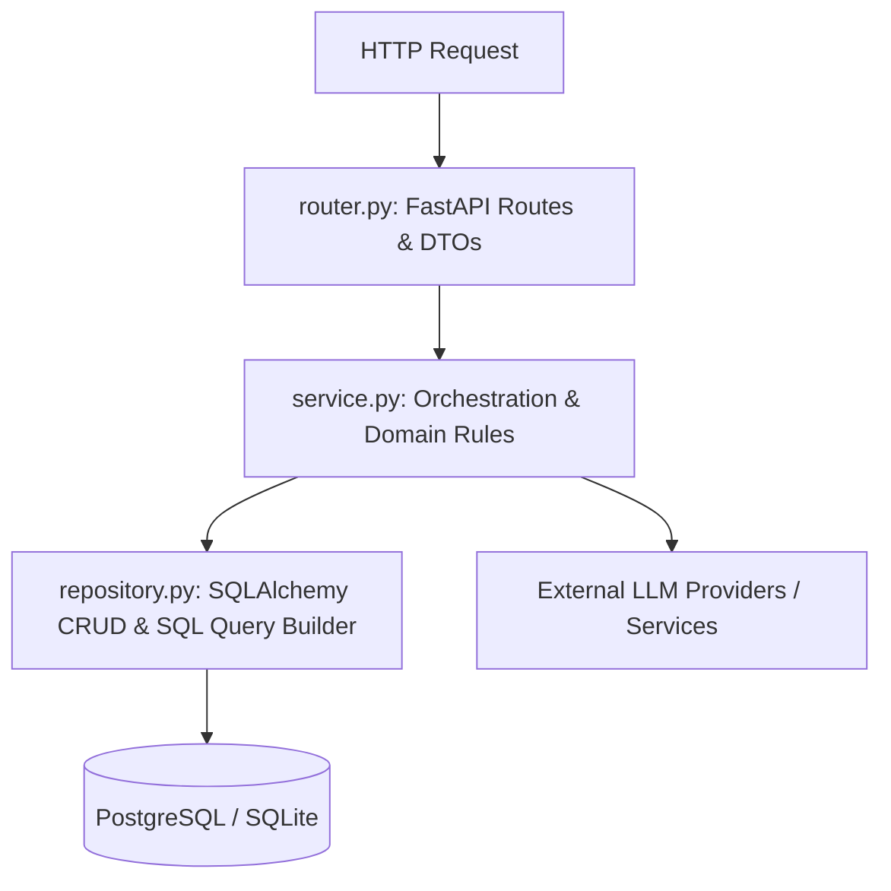

# The Bannered Mare: Project Structure and Architectural Pattern

The Bannered Mare is designed as a **Modular Monolith** (or Vertical Slices) architecture. Instead of separating the codebase into globally layered folders (such as all controllers in one place and all models in another), logic is organized around **domains** (features). Each domain is fully encapsulated within its own folder, making the system highly cohesive, easy to navigate, and modular.

---

## 1. Directory Structure Atlas

The codebase is organized as follows:

```text
backend/
├── alembic/                  # Database schema migrations (Alembic auto-managed)
├── docs/                     # Documentation folder
│   ├── implementation/       # Detailed backend architecture documents (this folder)
│   ├── llm_providers/        # LLM integration specifications
│   ├── st_analysis/          # SillyTavern codebase features analysis
│   └── st_comparison/        # SillyTavern design comparisons
├── src/                      # Source directory
│   ├── core/                 # Shared Kernel (Cross-cutting infrastructure)
│   │   ├── config.py         # Application configuration & Environment variable loading
│   │   ├── exceptions.py     # Centralized exceptions and HTTP handlers
│   │   ├── logging/          # Structured logging and auditing configuration
│   │   └── persistence/      # Base repository, DB session management, and base models
│   ├── [domain_module]/      # Vertical Slices (Domain slices)
│   │   ├── router.py         # API interface layer (routing, payload validation)
│   │   ├── service.py        # Business logic layer (orchestrating repo tasks)
│   │   ├── repository.py     # Data access layer (SQLAlchemy/SQL queries)
│   │   ├── models.py         # SQLAlchemy domain database models
│   │   ├── schemas.py        # Pydantic schemas (DTOs for requests and responses)
│   │   └── dependencies.py   # FastAPI dependencies (database session & service providers)
│   └── main.py               # Application entrypoint
├── tests/                    # Test suite mirroring the src/ structure
├── pyproject.toml            # Package, linter, formatting, and type-checker configs
└── alembic.ini               # Alembic configuration
```

---

## 2. Shared Kernel (`src/core/`)

Cross-cutting system infrastructure is grouped into `src/core/` to prevent domain slices from repeating boilerplate code:

### Configuration (`config.py`)
Centralized environment and project settings powered by `pydantic-settings`. It loads and validates configuration parameters like database URLs, log levels, allowed CORS origins, token limits, and local asset storage paths.

### Exception Handler (`exceptions.py`)
Defines the base system exceptions (e.g., `EntityNotFoundError`, `ValidationError`, `ProviderConnectionError`) and wires up FastAPI exception handlers. It maps service-layer exceptions to correct HTTP status codes in a centralized manner.

### Persistence Foundation (`persistence/`)
Initializes the SQLAlchemy asynchronous and synchronous engine and manages request-scoped database sessions. Contains the `BaseRepository` abstract class which implements common CRUD logic.

---

## 3. Vertical Slices Pattern

Each domain module (e.g., `character`, `chat_session`, `provider`) is an independent module with single-responsibility layers:



1. **Router Layer (`router.py`)**:
   - Focuses solely on parsing HTTP requests, verifying authorization, running request payload validations via Pydantic schemas (`schemas.py`), and returning serialized JSON responses.
   - It is strictly prohibited from containing raw database operations or multi-repository business orchestration.

2. **Service Layer (`service.py`)**:
   - House of business logic. Coordinates operations between multiple repositories, applies domain validations, and manages operations like building prompt messages or calling external LLM adapters.
   - Completely agnostic of the HTTP layer (e.g., does not use `Request` objects or return `JSONResponse`).

3. **Repository Layer (`repository.py`)**:
   - Responsible for execution of database queries, updates, and deletes.
   - Interacts with ORM mapping models and returns actual SQLAlchemy entities rather than Pydantic schemas.

4. **Dependencies (`dependencies.py`)**:
   - Manages FastAPI `Depends` factories, providing clean dependency injection (DI) of repositories, services, and scoped database sessions into routers.

---

## 4. Initialization and Seeding (`src/main.py`)

`main.py` bootstraps the FastAPI framework:
- Configures CORS middleware based on authorized origins.
- Wires up the exception mapping handlers.
- Automatically handles database startup tasks:
  1. Runs any database migration checks.
  2. Seeds base metadata if missing (such as pre-defined `Provider` systems, `ModelFamily` templates, and the default `PromptTemplate` presets).
