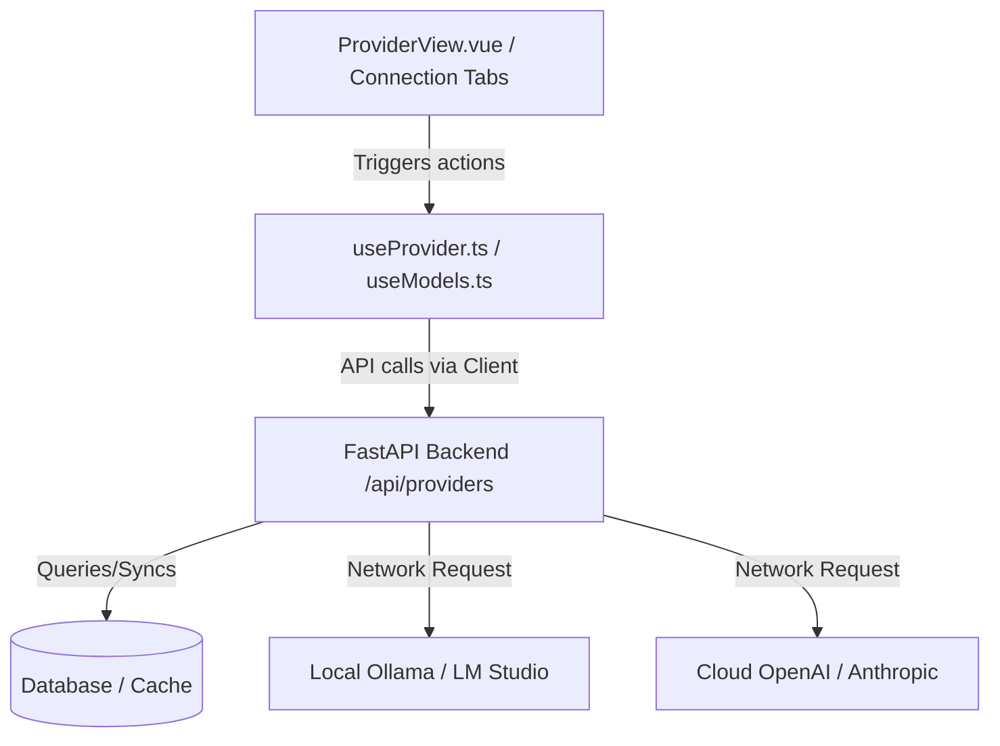

# Candlekeep UI: LLM Harness Agent and Connection Management

The frontend of Candlekeep Core integrates with the backend's multi-provider LLM system via an inference and connection management harness. This system allows users to define credentials, inspect active services, sync available models, load/unload local files, and tune parameters dynamically.

---

## 1. Architectural Role

The LLM Harness Agent bridges the frontend UI state and local/cloud inference backends:



It manages:
- **Provider Status**: Active/disabled toggles, base URLs, and environment variables.
- **Model Synchronization**: Triggering model sync calls to inspect new downloads in local directories.
- **Dynamic Loading/Unloading**: Explicitly spinning up or unloading model weights on local nodes (LM Studio).
- **Inference Parameter Overrides**: Providing key-value editors to set defaults on model families or session presets.

---

## 2. The `useProvider` Composable

State and orchestration for the connection manager are encapsulated within `useProvider` (defined in [useProvider.ts](file:///srv/project/personal/candlekeep-ui/src/composables/useProvider.ts)):

```typescript
export function useProvider() {
  const provider = ref<ProviderResponse | null>(null);
  const loading = ref(false);
  const saving = ref(false);
  const error = ref<Error | null>(null);

  const availableModels = ref<DiscoveredModel[]>([]);
  const modelsLoading = ref(false);
  const syncing = ref(false);
  const modelsError = ref<Error | null>(null);
  const pendingModelAction = ref<string | null>(null);

  // API operations...
  async function fetchProvider(id: string) { ... }
  async function saveProvider(id: string, updates: Record<string, unknown>) { ... }
  async function fetchAvailableModels(id: string) { ... }
  async function syncNow(id: string) { ... }
  async function loadModel(id: string, identifier: string) { ... }
  async function unloadModel(id: string, identifier: string) { ... }
}
```

### Key Operations
- **`syncNow(id)`**: Forces the backend to query local models directories and cache new entries in the database.
- **`loadModel(id, identifier)`**: Tells the local provider (such as LM Studio) to load the specified model weights into memory.
- **`unloadModel(id, identifier)`**: Tells the local provider to release the model weights from memory.

---

## 3. UI Components and Views

LLM configuration is presented through modular tabs and dedicated views:

### Provider Details View (`ProviderView.vue`)
Located at [ProviderView.vue](file:///srv/project/personal/candlekeep-ui/src/views/settings/ProviderView.vue), this page is the central hub for:
- Changing API keys, environment variable names, and endpoints.
- Verifying the connection status.
- Listing discovered models, showing their status (e.g. `loaded`, `cached`, `unloaded`), and providing action buttons to load, unload, or toggle availability.

### Connection Sub-Tabs (`src/components/connections/`)
- **`ProvidersTab.vue`**: Lists all configured API connections (OpenAI, Anthropic, Ollama, etc.) with active indicators.
- **`ModelsTab.vue`**: Displays all registered models with their associated families and active providers.
- **`ModelFamiliesTab.vue`**: Configures global parameters (temperature, penalties, limits) and formatting guidelines per family.
- **`ModelInferenceParams.vue`**: Standardized parameter input fields (sliders for temperature/top_p, lists for stop sequences) shared across presets and templates.
