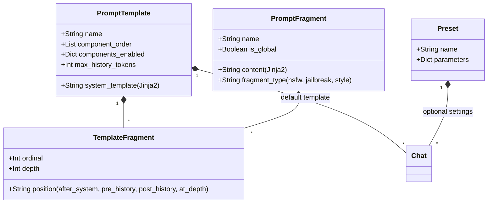
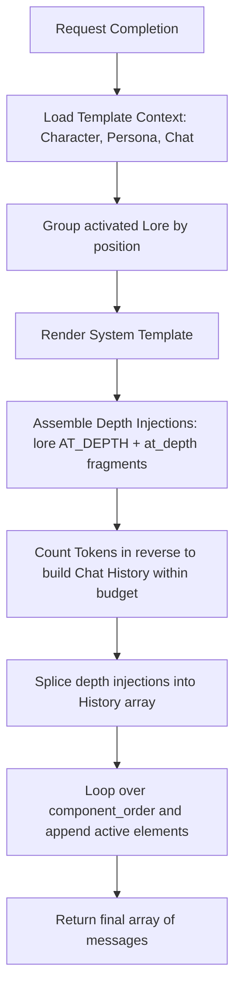

# The Bannered Mare: Prompt Construction & Template System

The Bannered Mare features a modular prompt construction engine that dynamically compiles structured prompts from presets, templates, character contexts, lore entries, and reusable instruction blocks (fragments).

---

## 1. Core Models and Relationships

1. **Preset**: Defines general generation settings (e.g., `temperature`, `top_p`, `max_tokens`) that override model defaults but don't contain prompt strings.
2. **PromptTemplate**: Configuration defining the core system layout, default system template, token limits, and component ordering.
3. **PromptFragment**: Reusable instructions (jailbreaks, formatting constraints, writing guidelines) written in Jinja2.
4. **TemplateFragment**: Join entity assigning fragments to templates, setting injection locations (`position`), ordering (`ordinal`), and history injection depths (`depth`).

---

## 2. Component Order & Toggles

Prompts are assembled by ordering modular sections based on the template's `component_order`. The default order includes:

| Component Name | Description |
| :--- | :--- |
| `system_prompt` | Central system message defining assistant identity (Jinja2 rendered). |
| `world_lore_before_character` | Activated lorebook entries targeted before the character description. |
| `character_context` | Respective character description and personality traits. |
| `world_lore_after_character` | Activated lorebook entries targeted after the character description. |
| `scenario` | General situational context of the roleplay scene. |
| `persona` | Respective description of the user's roleplay character. |
| `world_lore_before_examples` | Lore entries injected immediately before dialogue examples. |
| `example_dialogues` | Mock conversations formatting assistant response styles. |
| `rag_context` | Long-term memory snippets fetched from the vector search. |
| `chat_history` | History of messages within token limits. |
| `post_history_instructions` | Final system instructions placed after chat history to prevent instruction drift. |

Each component can be globally toggled on or off per template via `components_enabled`.

---

## 3. Fragment Injection Positions

Fragments are injected dynamically relative to the core components:

*   **`after_system`**: Injected immediately after the system prompt message.
*   **`pre_history`**: Injected after the example dialogues, right before the main chat history starts.
*   **`post_history`**: Injected immediately after the chat history.
*   **`at_depth`**: Injected directly into the chat history stream at a specified index (e.g., 4 messages from the end). Used for persistent style instructions and drift prevention reminders.

---

## 4. Prompt Construction Orchestration (`PromptBuilder`)

The prompt construction pipeline is owned by [PromptBuilder](https://github.com/delfianto/the-bannered-mare/blob/main/backend/src/prompt_template/prompt_builder.py):

### Depth Splicing Mechanism
To keep critical system guidelines active in the LLM's attention window, `at_depth` fragments and `AT_DEPTH` lore entries are spliced directly into the conversation history:
1. The builder resolves active depth injections.
2. It sorts them by depth in descending order (deeper/older entries first) so that inserting them doesn't shift the offsets of subsequent insertions.
3. It inserts each injection into the chat history array at index `len(history) - depth`.

### Token Budgeting
To prevent context overflow, the builder reads the chat session messages in reverse, calculates their token count using the `TokenizerService`, and constructs the active history slice dynamically until the `max_history_tokens` limit is reached.
