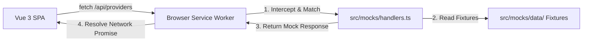

# The Bannered Mare: MSW Mock Harness and Offline Development

To facilitate offline testing and rapid frontend development, The Bannered Mare features an integrated mock network harness powered by **Mock Service Worker (MSW)**.


## 1. How the Mock Harness Works

Instead of mock configurations hardcoded inside components, MSW operates by registering a **Service Worker** in the browser. When the frontend attempts to make an API fetch call, the Service Worker intercepts the request at the network level:



This ensures the rest of the application remains fully unaware of the mocking, using standard HTTP fetch requests and headers.


## 2. Activation Controls

The mock harness is toggled via environment variables:

```bash
# Enable MSW mock mode
VITE_USE_MOCKS=true vp dev --host

# Enable mock mode and log requests to developer console
VITE_USE_MOCKS=true VITE_DEBUG_REQUEST=true vp dev --host
```

### Conditional Vite Proxy

In [vite.config.ts](https://github.com/delfianto/the-bannered-mare/blob/main/frontend/vite.config.ts), the configuration checks the `VITE_USE_MOCKS` flag.

- **If `false`**: Proxies `/api` network requests to the real FastAPI backend running at `http://localhost:8000`.
- **If `true`**: Disables the proxy backend target entirely, delegating intercept duties to MSW.


## 3. Directory Layout

Mock logic is encapsulated under [src/mocks/](https://github.com/delfianto/the-bannered-mare/blob/main/frontend/src/mocks/):

- **`handlers.ts`**: Implements 40+ endpoints mimicking backend behavior. Supports CRUD operations, pagination, filtering, and model loading state mutations.
- **`data/`**: JSON/JS files storing realistic test data mirroring seed fixtures:
  - **6 providers** (OpenAI, Anthropic, Ollama, LM Studio, etc.)
  - **19 model families** and **34 models**
  - **20 characters** (packaged with Unsplash avatar photos)
  - **20 chats** linked to YAML dialogue scripts
  - **Presets, templates, prompt fragments, and RAG data bank entries**
- **`data/scenarios/`**: Directory containing YAML scenario scripts describing multi-turn dialogues for character cards.
